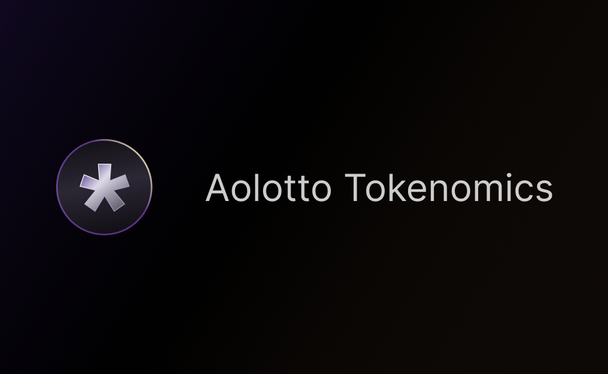
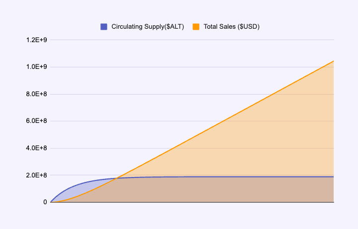

# 🪙 $ALT

<figure><figcaption></figcaption></figure>

Aolotto是首款基于AO发行的去中心化彩票协议，首创1美金链上投注，用户无许可匿名参与，投注及开奖由协议算法确保公平和透明。 Aolotto不属于任何私人或机构，100%社区化治理和去中心化运营。

## 什么是$ALT

$ALT(AoLottoToken)是Aolotto社区的粘合剂，也是LottoFi生态的流通货币。最大发行量不超过210,000,000 , 初始发行量为0，90%(189,000,000)通过[Bet2Mint](usdalt.md#bet2mint)机制铸造，10%(21,000,000)通过[水龙头](usdalt.md#shui-long-tou)以铸币Buff(ALTb)的方式奖励早期用户。

1. **质押分红**：Aolotto累计销售额($USD)的20%将通过质押分红分发给$ALT质押者；
2. **回购销毁**：Aolotto累计销售额($USD)的20%用于回购流通中的$ALT并销毁，促进代币的循环流通，稳定市值；同时也增加了用户的选择权，出售获取短期收益或持有获得长期分红。
3. **生态流通货币**：$ALT在LottoFi应用生态中具有货币和权益凭证属性，例如使用$ALT购买游戏道具，质押$ALT解锁特殊技能或内容。
4. **社区治理**：质押$ALT者拥有去中心化治理的资格，通过提案和投票，影响LottoFi生态的未来。

## AolottoFundation及铸币税

$ALT初始发行量为0，无团队预留，统一征收铸币量20%的铸币税支撑协议的运营和开发成本，激励创始团队及核心贡献者。用户通过Bet2Mint或水龙头铸造一枚新的$ALT，将会按照2:8比例分配给AolottoFundation和用户，在极限流通的情况下，AolottoFundation的持币总量不会超过最大供应量的20%，及42,000,000枚。

AolottoFundation是由核心成员和贡献者组成的去中心化组织（DAO），它将推动和维持Aolotto社区和LottoFi生态的持续发展和繁荣。铸币税兼顾了公平和持续激励的考量，有效防止传统Crypto项目在利益达成后跑路的风险。

## 发行机制

$ALT代币的铸币机制深度集成在Aolotto的投注协议中，通过用户的投注行为进行铸造，没有固定的发行周期, 释放速度取决于用户的活跃程度，当累计销售量达成～$210,000,000, $ALT的流通总量将趋于稳定。

<figure><figcaption>
累计销售突破～2亿后，$ALT将实现全流通
</figcaption></figure>

### Bet2Mint

90%的代币通过Bet2Mint(Bet to Mint)机制逐轮发行，每一次投注轮次启动将会基于$ALT未流通量重置**每轮铸币上限**，铸币上限随着流通量的增加而递减。参与当前轮次投注的用户将基于投注顺序获得**铸币奖励**，单笔投注的**铸币奖励以每轮铸币上限**为计算依据，随着本轮铸币量的增加而降低。

1. 每轮铸币上限 = ($ALT最大发行量 \* 0.9 - $ALT流通总量)  \* 0.002
2. 铸币速度 = 1 - $ALT流通总量 / $ALT最大发行量
3. 单次投注铸币奖励($ALT) =  (本轮铸币上限 - 本轮已铸币量 ) \* 0.001 \* 铸币速度 \* 投注量
4. 铸币实得($ALT) = 单笔投注铸币奖励 \* 0.8
5. 铸币税($ALT) = 单笔投注铸币奖励 \* 0.2

_注：铸币税由AolottoFundation征收，划入AolottoFundation治理合约中统一管理。_

### ALTb

10%的代币以铸币buff(ALTb)的方式奖励早期用户, 拥有铸币buff(ALTb)的用户在投注时会获得Bet2Mint铸币奖励基础之上，额外叠加$ALT奖励

$$
单次投注的奖励加成 = Math.min(单次投注铸币奖励，ALTb余额）
$$

_例如用户投注$1通过Bet2Mint获得200 $ALT的铸币奖励，与此同时，用户帐户中存在的ALTb余额为2000 ALTb, 那么用户在基础的铸币奖励之外可以获得额外200 $ALT, 这一笔投注累计获得400 $ALT, ALTb消耗后剩余1800 ALTb_

### 水龙头

水龙头是获取铸币buff (ALTb)的唯一方式，每一个用户可以通过水龙头免费领取1次ALTb，领取数量不是固定的，他会随着水龙头余额的减少而减少

$$
单用户可领取的额度 = 水龙头余额 * 0.0001
$$

_注：水龙头余额小于10万枚（预计会在第53469次领取后），将按照固定的余额\*0.0001的标准下发，直至余量耗尽永久关闭水龙头。_

## 质押分红

Aolotto协议每日下发一次分红，分红额度为销售额增量的的20%，分发的代币资产为AOX跨链桥发行的$wUSDC, 2025年全球彩票的市场规模将达到 4500亿美金，丰厚的利润被传统的彩票发行机构和渠道商垄断，去中心化彩票将会以更公平方式颠覆这一格局。Aolotto的所有收益将100%回馈社区，每一个$ALT持有者将会在持续发展的过程中受益。

Bet2Mint机制和持币分红鼓励早期用户参与，早期参与者投注1美金大约可以获得300枚左右的$ALT奖励，当Aolotto的累计销售额突破5亿美金(全球彩票市场份额的1000分之1)，1枚ALT带来的直接分红收益为\~0.5美金左右，除开投注本身带来的娱乐性和惊喜感，分红收益能直接带来的300倍的投资回报率甚至更多。

_注：协议于2025年3月20日正式将持币分红升级为质押分红，详情点击_[_质押分红_](usdalt.md#zhi-ya-fen-hong)

## 回购与销毁

累计销售额的20%将在投注时注入到回购合约，回购合约通过链上Agent自动向DEX市价回购流通中的$ALT, 回购周期由链上LLM驱动的Agent智能化决策，目标是平衡流通总量，稳定市值规模。回购的$ALT将会全部用于销毁，回购和销毁记录完全链上发生，公开透明。

回购机制和$ALT的发行机制(Bet2Mint)是密不可分的，一旦通过回购机制减少了流通总量，意味着每一轮投注启动的**铸币上限**就会增加，从而增强用户参与投注的积极性和持续性。

## LottoFi生态展望

LottoFi不是一个空洞的词语，它的价值来源于Aolotto协议向赢家征收的40%税收（等于累计销售额的40%），彩票是人们娱乐生活中不可或缺的一部分，据GLOBE NEWSWIRE的预测显示，2023-2028年，全球在线彩票市场的年复合增长率(CAGA)为9.45%，持续而强劲的用户需求是发展LottoFi生态的原生动力，与此同时，Aolotto将打造以$ALT为中心的应用生态，例如去中心化游戏，内容发行，NFT市场等，进一步增强$ALT的稀缺性。

1. **去中心化游戏**：以Play2Earn为代表的GameFi难以在Playing和Earning之间平衡，基于$ALT构建的游戏将改变这一现状。开发者不必费心打造代币模型，专注于游戏的娱乐性，吸引用户质押$ALT, 即可持续获得的分红受益，而游戏玩家则在一种“无损”的状态下获得游戏的快乐。
2. **去中心化内容发行**：$ALT质押式消费，将改变传统的内容付费的定价模式，从固定的版权式定价进化为灵活的基于消费时长的定价模式。
3. **去中心化应用**：非金融类的DAPP很难在去中心化世界立足，LottoFi的质押式消费为小额订阅制应用提供了良好的发展空间。

## 代币详情

1. 名称：Ao Lotto Token
2. 代币符号:  $ALT
3. 代币精度：12
4. 代币最小单位：lotto, 1 lotto = 0.000000000001 $ALT
5. 代币进程：DlApxvZDQFH26c0Tasakc0IE30wedGScoUNLtTLOIS4
