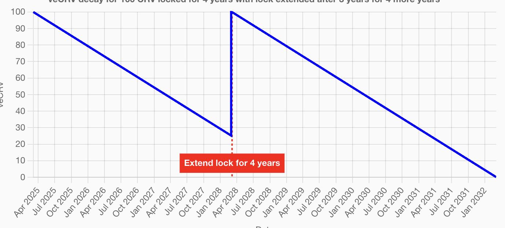

# 🎲 选号下注

投注方式下注十分简单，类似传统产品中的Pick3, 任意选择3位数号码(000-999), 设置投注数量，使用$wUSDC支付后即可完成投注

<figure><figcaption></figcaption></figure>

1. 游戏逐轮进行，参与者默认投注到当前进行中的最新轮次；
2. 支付代币为通过AOX跨链过来的[$wUDSC,](https://www.ao.link/#/token/7zH9dlMNoxprab9loshv3Y7WG45DOny_Vrq9KrXObdQ) 最小投注额度为$1, 最大投注额度为$100, 无需支付Gas费（AO主网上线后可能会存在忽略不计的Gas,GAS消耗为$AO不包含在投注金额内），确认支付后投注成功；
3. 每一次投注都会生成一张永久存放在Arweave上的投注票据，相当于传统发行的彩票，存放在Arweave上的彩票是一种具有可发现性的原子资产，相当于NFT，具有收藏价值。
4. 铸币奖励和ALTb释放与Bet2Mint机制有关，铸币奖励是你完成投注后，协议奖励基础$ALT， ALTb释放是在基础奖励之上的Buff(加成)，铸币Buff是面向早期用户的额外奖励，不代表所有的参与地址都拥有，[了解Bet2Mint详情](usdalt.md#bet2mint)

