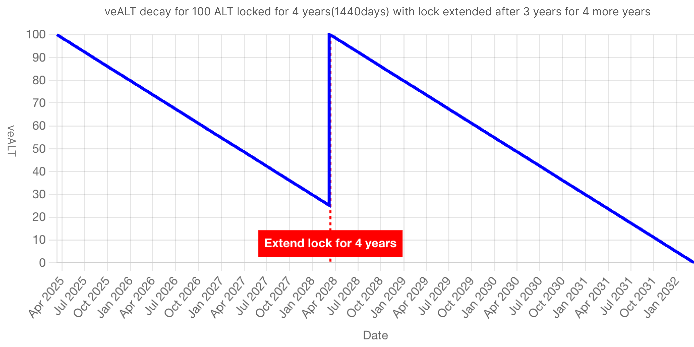
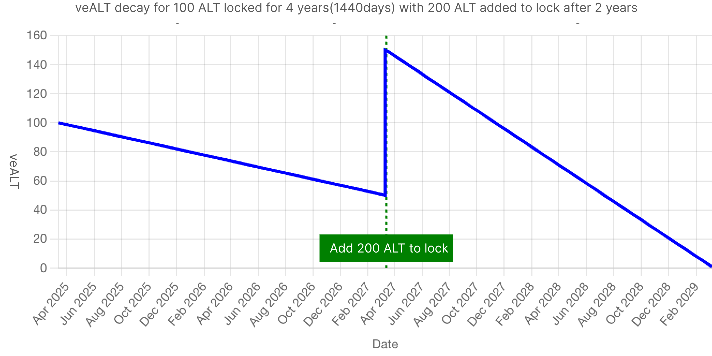

# 🔓 质押分红

Aolotto协议总销售额的20%（即累计利润的50%）用于质押分红，每日Aolotto协议的销售新增将于次日按照质押者的锁仓ALT(veALT)占比进行分配，veALT是一种不具备转账属性，并线性衰减的权益性代币，veALT参照veCRV设计，它是一种为**协调治理和激励而创建的概念，**&#x8FD9;和普通的流通性代币略有不&#x540C;**。**

用户锁定ALT获得veALT, 不仅可以按照占比赚取协议的持续分红，还能获得去中心化治理中的投票权益， 当用户参与链上提案的投票时，veALT的数量直接代表了投票权重。

## veALT — 锁仓$ALT

用户将$ALT存入质押合约后会获得相应比例的锁仓ALT(veALT, vote-escrowed ALT), 锁仓周期最短为1周(7天)，最长为4年(1440天)，锁定周期越长，得到的veALT就越多：

* 1 ALT 锁仓 4 年 = 1 veALT
* 1 ALT锁仓 3 年 = 0.75 veALT
* 1 ALT 锁仓 2 年 = 0.5 veALT
* 1 ALT 锁仓 1 年 = 0.25 veALT

#### 锁仓公式

$$
veALT = ALT * min(LockTimeLeft / 1440 days,1)
$$

1. 锁定周期最长为4年（1440天），超过最长锁定周期的汇率会保持为1ALT : 1veALT;
2. 最短锁定周期为1周（7天），协议不接受小于最小锁定周期的质押申请；

#### veALT衰减

用户拥有的 veALT 数量将随着时间的推移而线性衰减，对应锁仓公式中的`LockTimeLeft` ,当锁定时间不变的情况下，当前时间越大，实时的veALT余额越少

* 1枚ALT锁仓剩余7天 = 0.00486 veALT
* 1枚ALT锁仓剩余6天 = 0.00417 veALT
* ...
* 1枚ALT锁仓剩余1天 = 0.0007 veALT
* 1枚ALT锁仓剩余0天 = 0 veALT

#### 延长锁仓

用户可以不断延长锁仓（或一次性将锁仓时间延长至4年之后）从而增加实时的veALT余额，如果 Bob 锁定了 100 ALT 4 年，那么 3 年后她就只剩下 25 veALT，因为她的锁仓剩余时间是 1 年。如果她在 3 年后再次将锁定时间延长至 4 年，她将再次拥有 100 veALT：

<figure><figcaption></figcaption></figure>

#### 增加锁仓数量

将 ALT 添加到锁仓意味着解锁日期将保持不变，但锁定的ALT的数量提升，也能提升 veALT的数量。例如Bob 锁定了 100 ALT 4 年，但 2 年后又将 200 ALT 添加到她的锁定中，她将获得 150 veALT（2 年内总共锁定 300 CRV）。在接下来的 2 年里，这个 veALT 将继续衰减至 0

<figure><figcaption></figcaption></figure>

#### 解除质押

用户发起质押后，协议支持在任意时间解除质押，但更提倡用户在到期后解除，提前解除质押，用户将承担一定比例的罚没成本，例如，Bob锁仓100ALT到4年后，2年后Bob希望提前解除质押获得流动资金，那么Bob解除质押后实际可退还50个ALT，剩余50个ALT将作为损耗用于销毁；

$$
unlockALT = ALT * min(1-LockTimeLeft/LockedTime,1 )
$$

Bob如果选择到期后解除质押，则可以全额退还100ALT。

## 通过ALC提升锁仓汇率

ALC(AolottoLuckyClover)是由AolottoFoundation发行的系列NFTs，ALC NFT在Aolotto生态中不仅是身份象征，还能解锁特殊权益，当用户在质押ALT的基础上叠加ALC，可以获得更高的锁仓汇率，例如Bob锁仓100枚ALT 4年，获得100veALT, 叠加一枚ALC即可获得120veALT;

不同类型的ALC对应的提升比例不同，参照下表：

<table><thead><tr><th>ALC类型</th><th width="181.43359375">CA</th><th data-type="number">发行总量</th><th width="111.7109375">提升比率</th><th>获取方式</th></tr></thead><tbody><tr><td>AolottoLuckyClover - OG Edition</td><td>PURLGdY5k7ujpBM_j_5XkKbnE9Rv9ta8cr7EOPWYRqk</td><td>5000</td><td>0.2</td><td><a href="https://aopump.fun/#/trade/PURLGdY5k7ujpBM_j_5XkKbnE9Rv9ta8cr7EOPWYRqk">aopump.fun</a>, <a href="https://bazar.arweave.dev/#/asset/PURLGdY5k7ujpBM_j_5XkKbnE9Rv9ta8cr7EOPWYRqk">bazar</a></td></tr></tbody></table>

## 分红

分红的具体的实现流程为每日GMT 00:00（实际执行时间可能存在1-2分钟的偏差，但用于计算的时间戳为整点时间）请求质押进程中的实时veALT余额，按照用户的veALT的份额统计当日的分红数量并计入用户的可领取分红：

#### 分红来源

分红来源于彩票协议的销售利润，及协议累计销售额的20%，以及未来LottoFi生态产生的额外收益，分红以美金结算，分发的资产为AOX发行的跨链USDC （wUSDC）

CA：`7zH9dlMNoxprab9loshv3Y7WG45DOny_Vrq9KrXObdQ`

#### 提现分红

每日结算后的分红将会自动添加的质押受益人的账户中，用户需手工提取到钱包，单次最下提取金额不小于1美金；

## veALT的应用场景

* **链上治理** ：veALT 余额代表用户在 Aolotto协议治理中的投票权，这使得他们能够**对链上提案进行投票**，veALT数量 = 投票权重；
* **质押在LottoFi生态中的应用**：开发者吸引用户质押$ALT, 即可持续获得的分红受益，而用户则在一种“无损”的状态下获得游戏或应用中的特权；

## 协议信息：

1. CA: `kqDiKjXCwO16RJmjJqSNDbqdMVbrCaplEh7KnUHinlA`
2. Open Source: [https://github.com/aolotto/protocols/blob/main/stake.lua](https://github.com/aolotto/protocols/blob/main/stake.lua)

