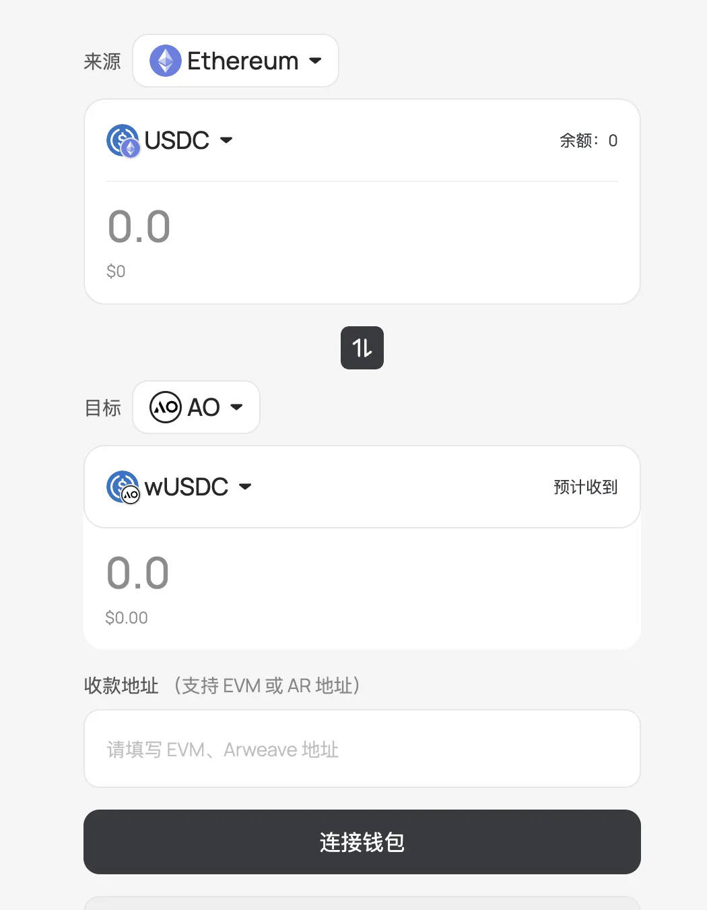

# 🔍 Deposit

To participate in Aolotto betting, payments are made using $wUSDC. This is a stablecoin wrapped by Ethereum's USDC, transferred via AOX. With AOX, you can easily deposit or withdraw funds from your Ethereum wallet  or exchange wallet. $wUSDC allows you to make payments and transfers within the AO ecosystem without gas fees, making it ideal for small transactions.

<figure><figcaption></figcaption></figure>

1. Go to [AOX](https://aox.xyz/#/beta) and click on the cross-chain bridge. Select Ethereum as the Source Chain and USDC as the target asset.
2. Choose AO as the Target Chain and select wUSDC as the asset.
3. Enter your AR wallet address (the one used for betting) as the recipient address.
4. Connect your wallet by selecting MetaMask or any Ethereum wallet.

Once you've confirmed the details, initiate the transfer, sign the transaction, and wait for Ethereum’s confirmation. Your AR wallet will receive the wUSDC.

## **Viewing wUSDC Balance in Your Wallet**

If you're using Arconnect and don’t see the wUSDC balance, you may need to manually add it. Follow these steps:

1. In Arconnect, go to **Settings** → **Tokens**.
2. Click **Import Token**, then select **Ao-Token**.
3. Enter the $wUSDC Contract Address: `7zH9dlMNoxprab9loshv3Y7WG45DOny_Vrq9KrXObdQ`, then confirm to add it.

**Note:** Your wUSDC deposit will automatically appear in the balance section of your personal center.

