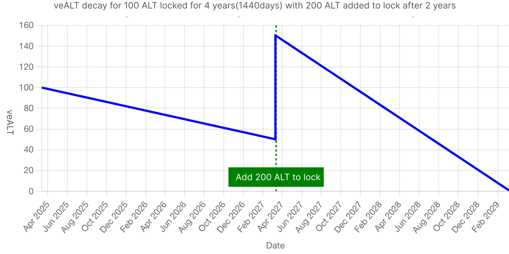

# 🔓 Staking

20% of Aolotto protocol’s total sales revenue (equivalent to 50% of accumulated profits) is allocated to staking dividends. The daily sales revenue generated by the Aolotto protocol is distributed at 00:00 (GMT) the following day based on the proportion of veALT held by stakers.

veALT is a non-transferable, linearly decaying governance token inspired by veCRV. It is designed to align governance and incentives, making it distinct from regular liquid tokens.

By locking ALT, users receive veALT, which not only grants them a share of the protocol's continuous dividends but also provides voting rights in decentralized governance. When participating in on-chain proposals, the amount of veALT a user holds directly determines their voting power.

## veALT — Locked $ALT

When users deposit $ALT into the staking contract, they receive a proportional amount of locked ALT (veALT, vote-escrowed ALT). The minimum lock duration is 1 week (7 days), while the maximum is 4 years (1,440 days). The longer the lock duration, the more veALT is received:

* 1 ALT locked for 4 years = 1 veALT
* 1 ALT locked for 3 years = 0.75 veALT
* 1 ALT locked for 2 years = 0.5 veALT
* 1 ALT locked for 1 year = 0.25 veALT

#### Locking Formula:

$$
veALT=ALT∗min(LockTimeLeft/1440days,1)
$$

1. The maximum lock duration is 4 years (1,440 days), and beyond this, the ratio remains 1 ALT : 1 veALT.
2. The minimum lock duration is 1 week (7 days), and the protocol does not accept staking applications below this period.

### veALT Decay

veALT balance decays linearly over time. As time progresses, the remaining lock duration (LockTimeLeft) decreases, reducing the real-time veALT balance:

* 1 ALT with 7 days left = 0.00486 veALT
* 1 ALT with 6 days left = 0.00417 veALT
* …
* 1 ALT with 1 day left = 0.0007 veALT
* 1 ALT with 0 days left = 0 veALT

### **Extending the Lock Duration**

Users can continuously extend their lock duration (or immediately extend it to 4 years) to maintain or increase their veALT balance.

For example, if Bob locks 100 ALT for 4 years, after 3 years, she will only have 25 veALT left, as her remaining lock duration is 1 year. If she extends her lock back to 4 years, she will regain 100 veALT.

<figure><figcaption></figcaption></figure>

### **Increasing the Locked Amount**

Adding more ALT to an existing lock will increase veALT, but the unlock date remains unchanged.

For example, if Bob initially locks 100 ALT for 4 years and then adds 200 ALT after 2 years, she will receive 150 veALT (since she has locked a total of 300 ALT over 2 years). Over the next 2 years, this veALT balance will continue to decay until it reaches 0.

<figure><figcaption></figcaption></figure>

### **Unstaking ALT**

Users can unstake their ALT at any time, but unstaking before the lock expires will incur a penalty.

For instance, if Bob locks 100 ALT for 4 years, but decides to unstake after 2 years, she will only be able to withdraw 50 ALT, with the remaining 50 ALT burned as a penalty.

#### Unstaking Formula:

$$
unlockALT=ALT∗min(1−LockTimeLeft/LockedTime,1)
$$

If Bob waits until the lock expires, she can withdraw the full 100 ALT without penalty.

## Boosting Locking Rate with ALC

AolottoLuckyClover (ALC) is a series of NFTs issued by Aolotto Foundation. Besides serving as a status symbol, ALC grants special privileges within the LottoFi ecosystem. By combining ALC with ALT staking, users can increase their veALT balance.For example, if Bob locks 100 ALT for 4 years, she normally receives 100 veALT. However, if she adds an ALC NFT, her veALT balance increases to 120 veALT.Different types of ALC provide varying boost rates, as shown in the table below:

<table><thead><tr><th>Type</th><th width="181.43359375">CA</th><th data-type="number">Total Supply</th><th width="111.7109375">Boost Rate</th><th>Acquisition Method</th></tr></thead><tbody><tr><td>AolottoLuckyClover - OG Edition</td><td>PURLGdY5k7ujpBM_j_5XkKbnE9Rv9ta8cr7EOPWYRqk</td><td>5000</td><td>0.2</td><td>aopump, bazar</td></tr></tbody></table>

## Dividend Distribution

The specific implementation process for dividend distribution is as follows: At GMT 00:00 daily (with a possible execution deviation of 1-2 minutes, but the timestamp used for calculation is the exact hour), the system queries the real-time veALT balance in the staking process. Based on the user's veALT share, the daily dividend amount is calculated and credited to the user's claimable dividends.

### Dividend Sources

Dividends come from the sales profits of the lottery protocol, 20% of the protocol's cumulative sales, and additional future earnings generated by the LottoFi ecosystem. Dividends are settled in USD, and the distributed asset is the cross-chain USDC (wUSDC) issued by AOX.

CA: `7zH9dlMNoxprab9loshv3Y7WG45DOny_Vrq9KrXObdQ`

### Dividend Withdrawal

The dividends settled daily will be automatically added to the staking beneficiary's account. Users must manually withdraw them to their wallets, with a minimum withdrawal amount of $1 per transaction.

## veALT Use Cases

* On-Chain Governance: The veALT balance represents the user's voting power in the Aolotto protocol governance, allowing them to vote on on-chain proposals. veALT amount = Voting weight.
* Application in the LottoFi Ecosystem: Developers can attract users to stake $ALT to receive continuous dividend benefits, while users can enjoy privileges in LottoFi ecosystem games or applications under a "lossless" staking model.

## Protocol Information

1. CA: _<mark style="background-color:purple;">Announced after launch.</mark>_
2. Open Source: _<mark style="background-color:purple;">Announced after launch.</mark>_

