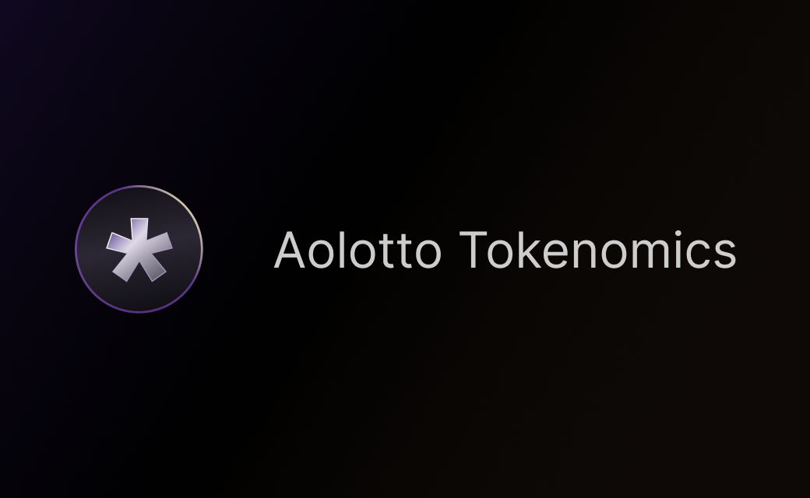

---
layout:
  title:
    visible: true
  description:
    visible: false
  tableOfContents:
    visible: true
  outline:
    visible: true
  pagination:
    visible: true
---

# 🪙 $ALT

<figure><figcaption></figcaption></figure>

Aolotto is the first decentralized lottery protocol based on AO , pioneering $1 on-chain betting. Users can participate anonymously without permission, and both the betting and drawing are ensured to be fair and transparent through the protocol's algorithms. Aolotto is not controlled by any private entity or organization and operates under 100% community governance and decentralization.

## What is $ALT?

$ALT (AoLottoToken) is the glue of the Aolotto community and the circulating currency of the LottoFi ecosystem. The maximum supply is capped at 210,000,000, with an initial supply of 0. Of the total supply, 90% (189,000,000) will be minted through the [Bet2Mint](usdalt.md#bet2mint) mechanism, and 10% (21,000,000) will be distributed as a minting buff ($ALTb) to early users via the [faucet](usdalt.md#faucet).

* **Token Dividends**: 20% of Aolotto's cumulative sales ($USD) will be distributed proportionally to $ALT token holders as dividends.
* **Buyback & Burn**: 20% of Aolotto's cumulative sales ($USD) will be used to buy back and burn circulating $ALT tokens, promoting token circulation and stabilizing market cap. This mechanism also gives users the option to sell for short-term profits or hold for long-term dividends.
* **Ecosystem Currency**: $ALT serves as both a currency and a proof of rights within the LottoFi ecosystem, such as using $ALT to purchase game items or staking $ALT to unlock special skills or content.
* **Community Governance**: Token holders have the right to participate in decentralized governance through proposals and votes, influencing the future of the LottoFi ecosystem.

## **AolottoFundation and Minting Tax**

The initial supply of $ALT is 0, with no team allocation. A minting tax of 20% on minted tokens is applied to support the operational and development costs of the protocol and to incentivize the founding team and core contributors. Users mint $ALT tokens through Bet2Mint or faucet, and 20% of the minted tokens will be allocated to AolottoFoundation, while 80% will go to the users. In the case of maximum circulation, the total holding of AolottoFundation will never exceed 20% of the maximum supply, or 42,000,000 tokens.

AolottoFundation is a decentralized organization (DAO) composed of core members and contributors, dedicated to driving and maintaining the continuous development and prosperity of the Aolotto community and the LottoFi ecosystem. The minting tax ensures fairness and ongoing incentives, effectively preventing the risk of traditional crypto projects abandoning their users after reaching their profit goals.\

## **Issuance Mechanism**

The $ALT minting mechanism is integrated into Aolotto's betting protocol, with tokens minted based on user bets. There is no fixed issuance cycle, and the release rate depends on user activity. Once cumulative sales reach $210,000,000, the total circulation of $ALT will stabilize.

<figure><figcaption>
After cumulative sales exceed ~200 million, $ALT will achieve full circulation.
</figcaption></figure>

### **Bet2Mint**

90% of the tokens are minted through the Bet2Mint (Bet to Mint) mechanism in rounds. Each round begins by resetting the minting cap based on the circulating supply of $ALT. As the circulating supply increases, the minting cap decreases. Users participating in the current round of betting will receive minting rewards based on the order of their bets, with the rewards per bet decreasing as the minting volume increases in the current round.

* Minting Cap per Round = (Maximum Supply \* 0.9 - Total Circulating Supply) \* 0.002
* Minting Speed = 1 - Total Circulating Supply / Maximum Supply
* Minting Reward per Bet ($ALT) = (Current Round Minting Cap - Minted Amount) \* 0.001 \* Minting Speed \* Bet Amount($USD)
* Minted Tokens ($ALT) = Minting Reward per Bet \* 0.8
* Minting Tax ($ALT) = Minting Reward per Bet \* 0.2

_Notes: The minting tax is collected by AolottoFundation and managed through the AolottoFundation governance contract._

### **Faucet**

10% of the tokens are distributed through the faucet as a minting buff (ALTb) to reward early users. Users with the minting buff (ALTb) will convert it into $ALT when placing a bet, adding it to the $ALT rewards earned via the Bet2Mint mechanism. Each community member can claim the minting buff (ALTb) once for free from the faucet, with the available amount of ALTb decreasing as the faucet balance declines.

* Minting Buff (ALTb) = Faucet Balance \* 0.0001
* Minting Speed = 1 - Total Circulating Supply / Maximum Supply
* Minted $ALT per Bet = MIN(Minting Buff \* 0.01 \* Bet Amount($USD) \* Minting Speed, Minting Buff Balance)
* Minted Tokens ($ALT) = Minted $ALT per Bet \* 0.8
* Minting Tax ($ALT) = Minted $ALT per Bet \* 0.2

_Notes: When the faucet balance drops below 100,000 $ALT (expected after the 53,469th claim), the distribution will proceed based on the fixed amount \* 0.0001 standard until the balance is exhausted, and the faucet will be permanently closed. The $ALT released via ALTb will be subject to the same 20% minting tax as the $ALT released through the Bet2Mint mechanism, which is collected by the AolottoFoundation and managed within its governance contract._

## **Token Holder Dividends**

The Aolotto protocol triggers dividends every 4 hours, with the dividend amount set at 20% of the sales increment. If the sales increment is less than $1,000, it will carry over to the next dividend cycle. Dividends are directly distributed to holders' wallet addresses in the form of $wUSDC minted via the AOX cross-chain bridge.

The global lottery market is expected to reach $450 billion by 2025, and the traditional lottery issuers and distributors dominate this lucrative market. Decentralized lotteries will disrupt this landscape in a fairer way. All the profits from Aolotto will be 100% returned to the community, and every $ALT holder will benefit from the continuous development of the platform.

The Bet2Mint mechanism and token dividends encourage early user participation. Early participants can earn approximately 300 $ALT tokens by betting $1. When Aolotto's cumulative sales exceed $500 million (1/1000th of the global lottery market share), the direct dividend for each $ALT could be around $0.5. Apart from the entertainment and excitement of betting itself, the dividend offer the potential for a 300x investment return or even more.

## **Buyback and Burn**

20% of cumulative sales will be injected into the buyback contract during betting. The buyback contract will automatically repurchase circulating $ALT at market prices on DEX through an on-chain agent. The buyback cycle is driven by intelligent decisions from an on-chain LLM-powered Agent, aiming to balance the total supply and stabilize the market value. The $ALT tokens bought back will be fully burned, and all buyback and burn transactions will occur transparently on-chain.

The buyback mechanism is closely tied to the $ALT issuance mechanism (Bet2Mint). When the buyback reduces the circulating supply, it will increase the minting cap for each round of betting, thereby enhancing user participation and long-term engagement.

## **LottoFi Ecosystem Outlook**

LottoFi is not just an empty term; its value comes from the 40% tax levied on winners through the Aolotto protocol (which is equivalent to 40% of cumulative sales). Lottery is an indispensable part of people's entertainment. According to GLOBE NEWSWIRE, the global online lottery market is expected to grow at a CAGR of 9.45% from 2023 to 2028. Strong and sustained user demand is the driving force behind the development of the LottoFi ecosystem. Meanwhile, Aolotto will create a $ALT-centric application ecosystem, including decentralized games, content distribution, NFT markets, etc., further increasing the scarcity of $ALT.

* **Decentralized Games**: GameFi models like Play2Earn struggle to balance playing and earning. Games built on $ALT will change this situation. Developers won't need to worry about token models and can focus on the game's entertainment value. By staking $ALT, users can receive ongoing dividend rewards, while players can enjoy the game in a “no-loss” environment.
* **Decentralized Content Distribution**: $ALT staking-based consumption will change the traditional content payment pricing model, evolving from fixed royalty-based pricing to flexible pricing based on consumption duration.
* **Decentralized Applications**: Non-financial DApps often struggle to establish themselves in the decentralized world. LottoFi's staking-based consumption offers a promising growth space for micro-subscription applications.

## **Token Details**

* **Name**: Ao Lotto Token
* **Symbol**: $ALT
* **Denomination**: 12
* **Smallest Token Unit**: lotto, 1 lotto = 0.000000000001 $ALT
* **Token Process**: 3IYRZBvph5Xx9566RuGWdLvUHnOcG8cHXT95s1CYRBo
